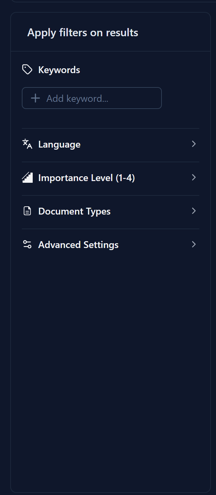
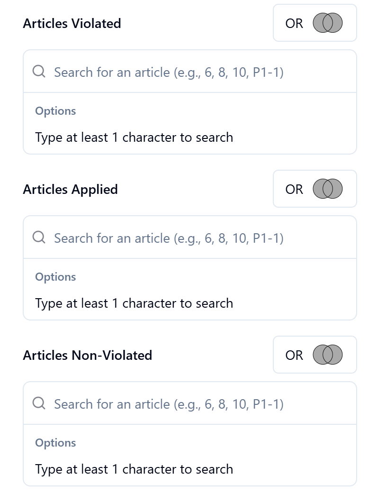
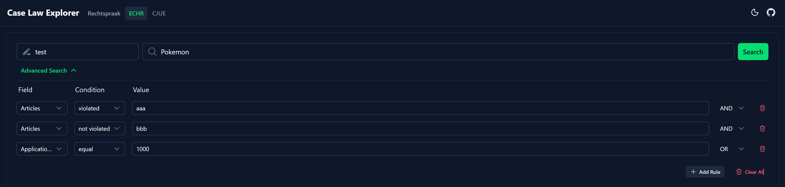

# High-Level Approach: Improving the Case Law Search Experience

This document outlines the design strategy and considerations for enhancing the search and filtering functionality of the BISS Case Law Explorer.

## 1. Design Considerations

Before trying to implement new features, I focused on testing the search and filtering function on the original website. I noticed that all the search function and filters are hidden in a drawler which made me feel very inconvient when trying to search something. Based on this observation, I identified several key areas for improvement:

### Reducing Cognitive Load

- **Disclosure**: Advanced settings and secondary filters are moved away from the drawler. Instead, it was put next to the main result table. This keeps the primary interface clean and prevents "hidden features" for new users.
- **Visual Cues**: Icons and clear typography are used to differentiate between different types of metadata (e.g., tags for keywords, calendars for dates).

### Accessibility for Non-Technical Scholars

- **Natural Language Focus**: The interface uses plain English (e.g., "Field", "Condition", "Value") instead of technical or database-specific terminology.
- **Interactive UI Elements**: Large, clickable areas and intuitive toggles make the interface approachable for users who may not be familiar with complex legal databases.

## 2. How were these improvements designed?

The redesign focused on transforming the search process from a "one-shot" attempt into an **iterative exploration**.

### Dynamic Rule Builder (`AdvancedSearch.vue`)

I personaly like the idea of the logical search builder from the original design:

However, I found it could be made more user-friendly by implementing the following changes (inspired by Cloudflare's firewall rule builder):

- **Logical Composition**: Instead of a fixed set of fields, I implemented a dynamic rule builder. This allows users to combine multiple criteria using the `AND`/`OR` logic.
- **Context-Aware Fields**: The search fields and their corresponding conditions (e.g., "contains", "starts with") are programmatically linked, ensuring users only see valid options for their chosen field.
- **Iterative Refinement**: Users can start with a broad query and add specific rules as they see the results, reducing the pressure to "get it right" the first time.

### Intelligent Filtering Sidebar (`ResultFilter.vue`)

- **Discovery-First Design**: Instead of expecting researchers to know keywords and domains beforehand, the sidebar exposes these as interactive categories (Keywords, Domains, ECLIs).
- **Hierarchical Organization**: Filters are organized into a tree structure where appropriate, allowing users to toggle entire branches (e.g., a main legal domain and all its sub-domains) with a single click.
- **Apply Filters on the fly**: Filters are applied immediately upon selection, providing instant feedback and allowing users to see the impact of their choices in real-time.

## 3. Demonstration

